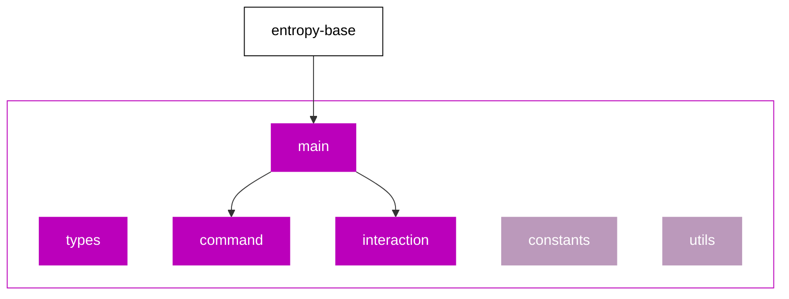

# Domain Template

This folder described how we structure our "Domain" folders.

_Diagram showing the required + optional files, and key dependencies._

- `main.ts` - the core functions used by the flow (inherits from `EntropyBase`)
- `command.ts` - the programmatic CLI functions (depends on `main.ts`)
- `interactions.ts` - the TUI (text user interface) functions (depends on `main.ts`)
- `types.ts` - all the types/interfaces used in this flow
- `constants.ts` (optional) - constants used in this flow
- `utils.ts` (optional) - help function used in this flow
